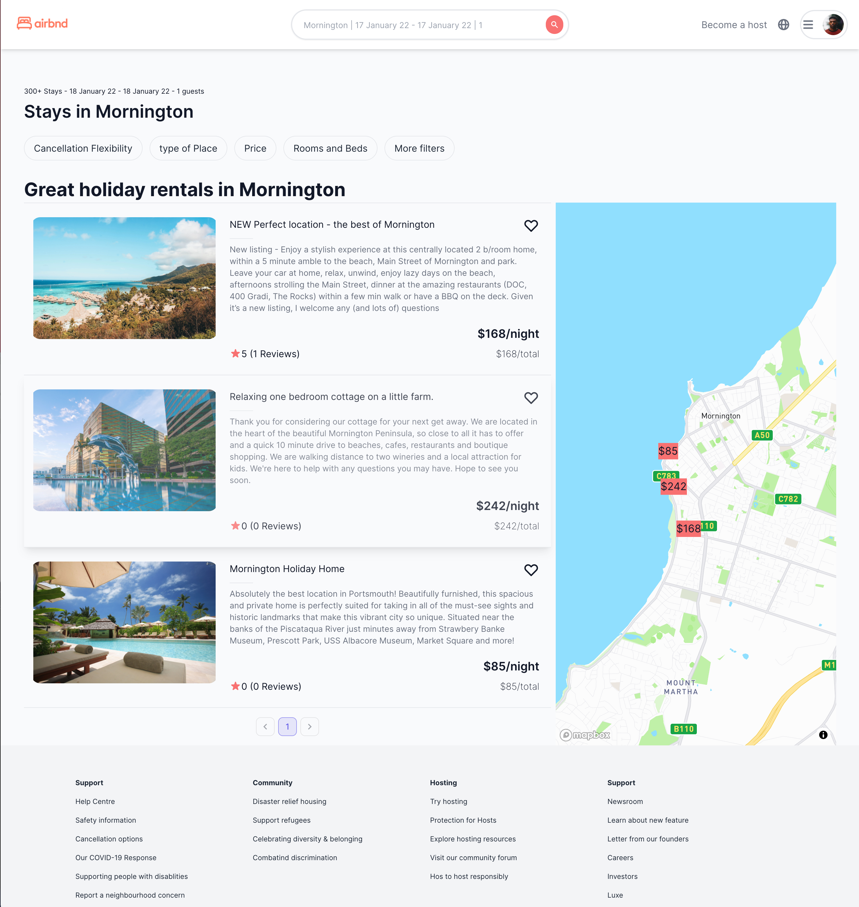
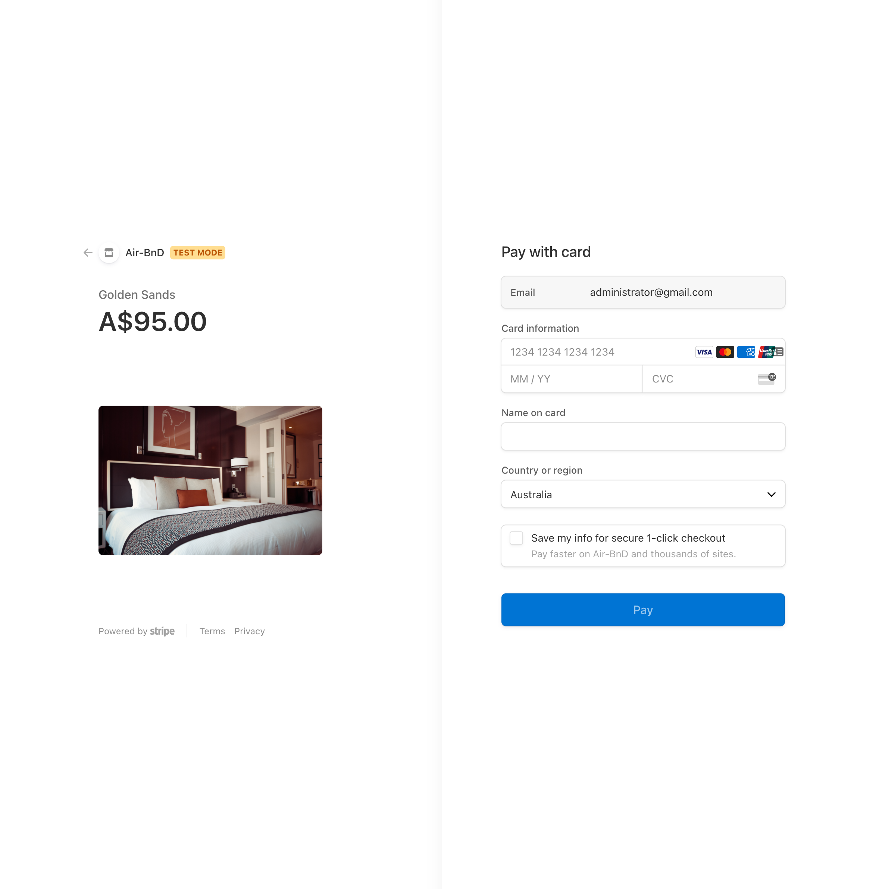
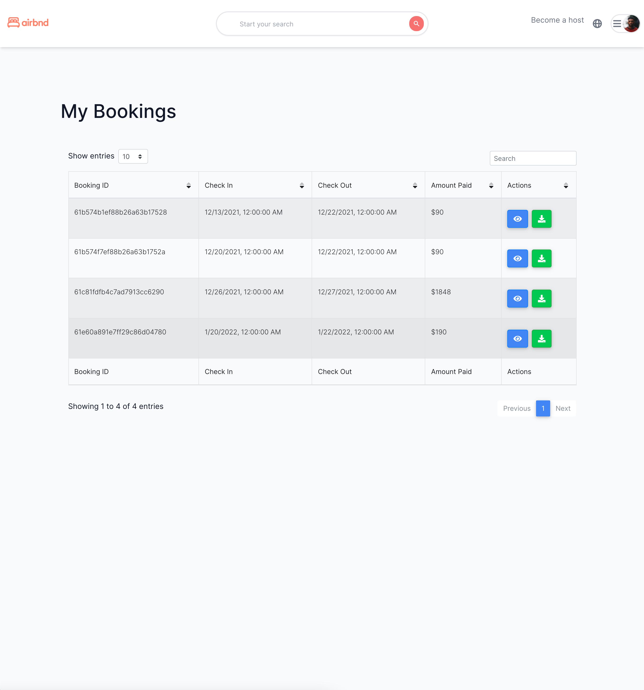
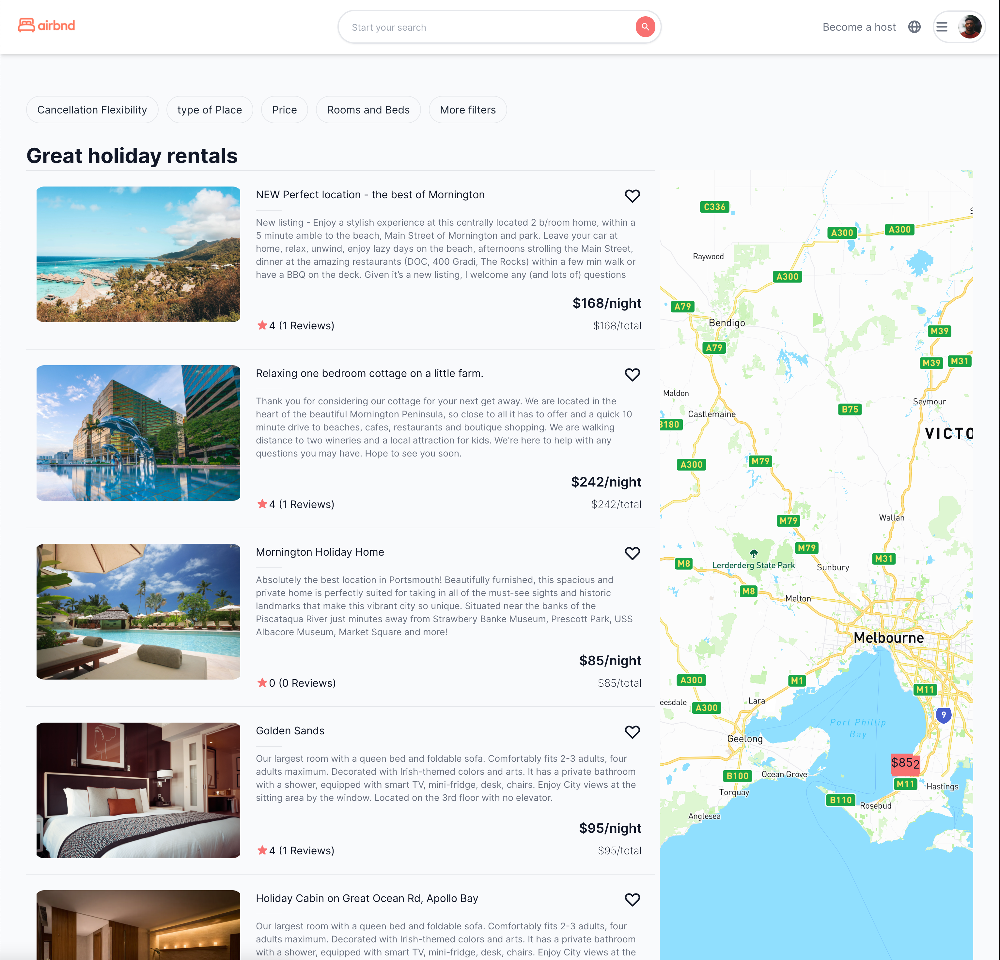

[](https://www.buymeacoffee.com/cmtanko)

# Airbnd | NextJs

Airbnd is a airbnb clone with almost same functionality, based on NextJs. Book your next trip with Airbnd.

## APP Link

- [WebApp] (https://airbnd-delta.vercel.app/)

## Features:

- [x] List nearby rentals.
- [x] Search by location.
- [x] Backend with NextJs.
- [x] Frontend with NextJs.
- [x] Styling with tailwindcss.
- [x] BoxMap Integration.
- [x] Checkout with Stripe.
- [x] Download receipt with easyinvoice.
- [x] Functionality to Rate and Review.
- [x] View your bookings

## Screenshots









## Environment Versions

- Next: 12.0.5
- Node: 12.22.1
- React: 17.0.2

## Installation

```
  yarn install
```

## Environment Setup
```
export STRIPE_API_KEY="YOUR_KEY"
export STRIPE_SECRET_KEY="YOUR_KEY"
export STRIPE_WEBHOOK_SECRET="YOUR_KEY"
export DB_URL="YOUR_DB_URL"
export MAP_BOX_ACCESS_TOKEN="YOUR_MAP_KEY"
```
## Run Dev

```
  yarn dev
```

## Deployment

```
  yarn build
```
